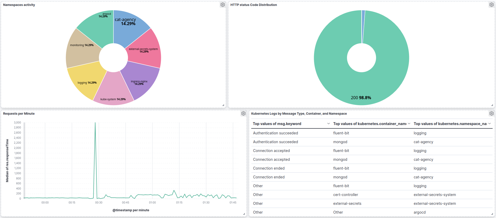

# GitOps Repository

This repository contains the GitOps configuration for deploying and managing the application and the infrastructure applications and services on a Kubernetes cluster using Argo CD.


# Full Architecture


# Argocd View


# Grafana Dashboard


# Kibana Dashboard



## Repository Structure

```
Portfolio-Develeap-GitOps/
├── application-parent.yaml          # Root App of Apps for applications
├── infra-app-parent.yaml           # Root App of Apps for infrastructure
│
├── applications/                    # Application layer
│   ├── app/                        # Main Cat Agency Helm chart
│   │   ├── Chart.yaml
│   │   ├── values.yaml
│   │   └── templates/
│   ├── cat-agency-stack.yaml       # Cat Agency ArgoCD Application
│   ├── mongodb-operator.yaml       # MongoDB operator deployment
│   ├── mongodb-prerequisites.yaml  # MongoDB resources
│   └── prometheus-stack.yaml       # Monitoring stack
│
├── infra/                          # Infrastructure layer (organized by concern)
│   ├── core/                       # Core networking & certificates
│   │   ├── cert-manager.yaml      # Certificate lifecycle management
│   │   ├── external-dns.yaml      # Automatic DNS record creation
│   │   ├── ingress-nginx.yaml     # NGINX Ingress Controller
│   │   └── persistent-ingress-lb.yaml  # NLB persistent configuration
│   │
│   ├── security/                   # Secret management
│   │   ├── external-secrets-operator.yaml  # AWS Secrets Manager integration
│   │   └── sealed-secrets-app.yaml         # Encrypted secrets in Git
│   │
│   ├── logging/                    # ELK Stack components
│   │   ├── elasticsearch.yaml     # Log storage & indexing
│   │   ├── kibana.yaml            # Log visualization
│   │   ├── fluent-bit.yaml        # Log collection (DaemonSet)
│   │   ├── secretstore.yaml       # External secret store config
│   │   └── externalsecret.yaml    # External secret references
│   │
│   ├── logging.yaml               # Logging parent ArgoCD Application
│   └── ClusterIssuer.yaml         # Let's Encrypt ClusterIssuer
│
├── manifests/                      # Raw Kubernetes manifests
│   ├── cluster-issuer/
│   ├── mongodb/
│   └── prometheus-additional-config.yaml
│
├── scripts/                        # Operational scripts
│   ├── cleanup-k8s-resources.sh
│   └── mongodb-troubleshoot.sh
│
├── Images/                         # Documentation images
└── README.md
```


